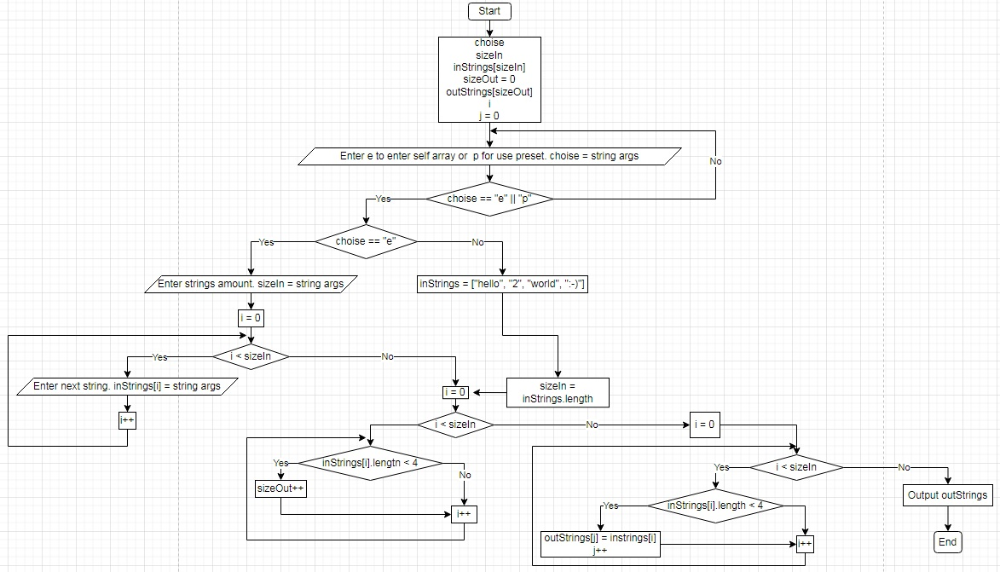

# Программа, котоая из исходного массива строк формирует массив строк, длинна которых не более 4х символов.
## Для удобства тестирования сделана возможность, как вводить исходный массив с клавиатуры, так и воспользоваться предустановленным массивом.
Так как **НЕ** рекомендовалось пользоваться коллекциями было решено сначала вычислить длину выходного массива и не печатать пустые строки, если *в исходном массиве не было пустых строк*, но пришлось лишний раз пройтись циклом по исходному массиву.
Отказаться от дополнительного цикла можно  
 раскомментировав:
 * outSize = inSize; *(строку 27)*   

 закомментировав:
 * int outSize = CalculateOutArraySize(inStrings); *(строку 28)*
 * метод "CalculateOutArraySize" *(с 73й по 82ю строку)*
 ## Блок-схема программы
 
 ## Основную задачу выполняет метод **FormOutArray**